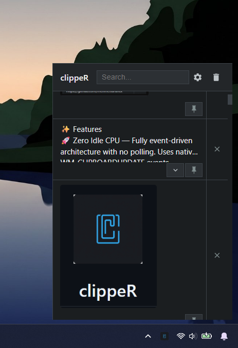

<p align="center">
  
</p>

<h1 align="center">clippeR</h1>

<p align="center">
  A lightning-fast, minimalist clipboard manager for Windows.<br>
  Built with Rust, Tauri 2.0, and Vanilla JS.
</p>

<p align="center">
  <a href="../../releases"></a>
  
  
</p>

<p align="center">
  
</p>

---

## ✨ Features

- 🚀 **Zero Idle CPU** — Fully event-driven architecture with no polling. Uses native `WM_CLIPBOARDUPDATE` events.
- 🖼️ **Image Support** — Automatically captures and displays copied images as PNG previews.
- 📌 **Pin Items** — Pin your most important clips so they are never lost, even when clearing history.
- ⚙️ **In-App Settings** — Easily configure your preferences directly from the app.
- ⚡ **Global Shortcut** — Set a custom key combination to toggle the window from anywhere (Default: `Alt + V`).
- 🚀 **Launch at Startup** — Option to automatically start the app silently when Windows boots.
- 📚 **Configurable History** — Adjust the clipboard history limit between 50 and 500 items.
- 🔍 **Instant Search** — Filter through your clipboard history in real time.
- 💾 **Persistent History** — Stored locally in SQLite. Survives restarts, never loses data.
- 🖱️ **System Tray** — Lives quietly in your taskbar. Click away to dismiss.
- 🧹 **Clean Delete** — Deleting entries also removes associated image files from disk.

## 📥 Installation

1. Download the latest installer from the [Releases](../../releases) page.
2. Run `clipper_x64-setup.exe`.
3. Press `Alt + V` (or your custom shortcut) or click the tray icon to start.

## 🛠️ Development

```bash
git clone https://github.com/mehmetturuncx/clippeR.git
cd clippeR
npm install
npm run tauri dev   # Run locally
npm run tauri build # Build executable
```

**Prerequisites:** [Node.js](https://nodejs.org/) (v16+), [Rust](https://www.rust-lang.org/tools/install), MSVC Build Tools

## ⚙️ Tech Stack

| Layer | Technology |
|-------|-----------|
| Frontend | Vanilla HTML / CSS / JS |
| Backend | Rust |
| Framework | Tauri 2.0 |
| Database | SQLite (rusqlite) |
| Clipboard | arboard + clipboard-master |

## 📄 License

This project is licensed under the MIT License - see the [LICENSE](LICENSE) file for details.
