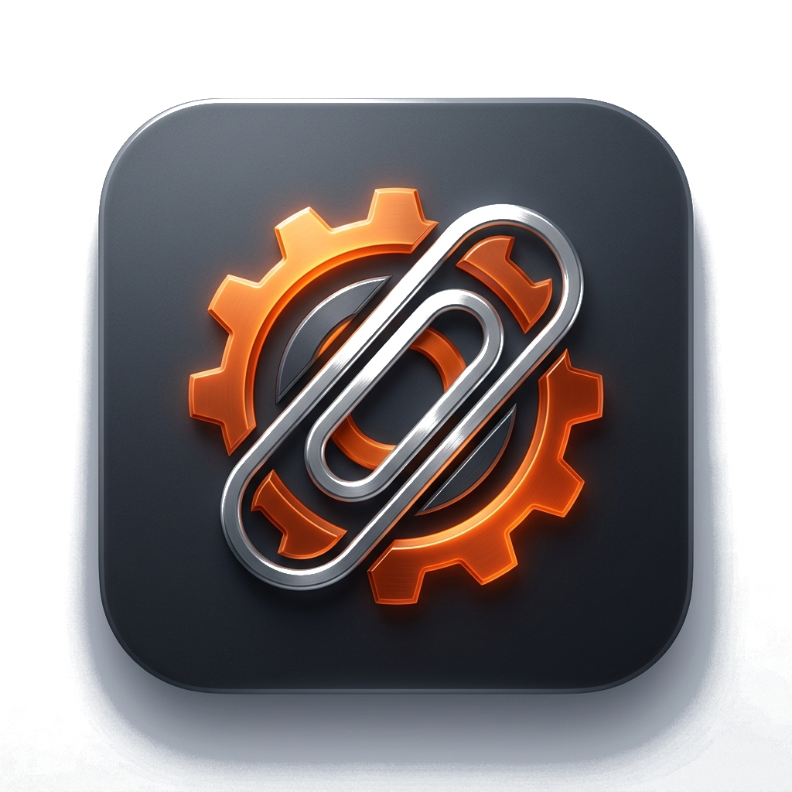

# clippeR 📎🦀

A modern, fast, and sleek Clipboard Manager built with [Rust](https://www.rust-lang.org/) and [Tauri](https://tauri.app/).

<p align="center">
  
</p>

## 🌟 Features
- **System Tray Integration**: Operates gracefully as a lightweight system tray popup notification.
- **Glassmorphism UI**: Beautiful, fully transparent blur UI that blends elegantly into your desktop environment.
- **Persistent History**: Powered by an embedded SQLite database, ensuring you never lose your clipboard history.
- **Global Shortcut**: Access your clipboard history instantly from anywhere using `Alt + V`.
- **Auto-Hide**: The interface elegantly hides itself when you click away.
- **Smart Expansion**: Long text strings automatically collapse, providing a neat interface with a "▼" button to expand and read the full content.

## 🚀 Getting Started

### Prerequisites
- [Node.js](https://nodejs.org/) (v16 or newer)
- [Rust](https://www.rust-lang.org/tools/install)
- OS-specific Tauri prerequisites (e.g. MSVC C++ Build Tools for Windows).

### Installation

1. Clone the repository:
   ```bash
   git clone https://github.com/yourusername/clippeR.git
   cd clippeR
   ```

2. Install frontend dependencies:
   ```bash
   npm install
   ```

3. Run in development mode:
   ```bash
   npm run tauri dev
   ```

## 🛠️ Building for Production

To compile the application into a standalone executable or installer:

```bash
npm run tauri build
```

Once finished, you can find the `.exe` and `.msi` setup files in the `src-tauri/target/release/bundle/` directory.

## ⚙️ Tech Stack
- **Frontend**: Vanilla HTML/CSS/JS (Ultra-fast & lightweight)
- **Backend**: Rust
- **Framework**: Tauri 2.0
- **Database**: SQLite (`rusqlite`)

## 📄 License
This project is open-source and available under the MIT License.
